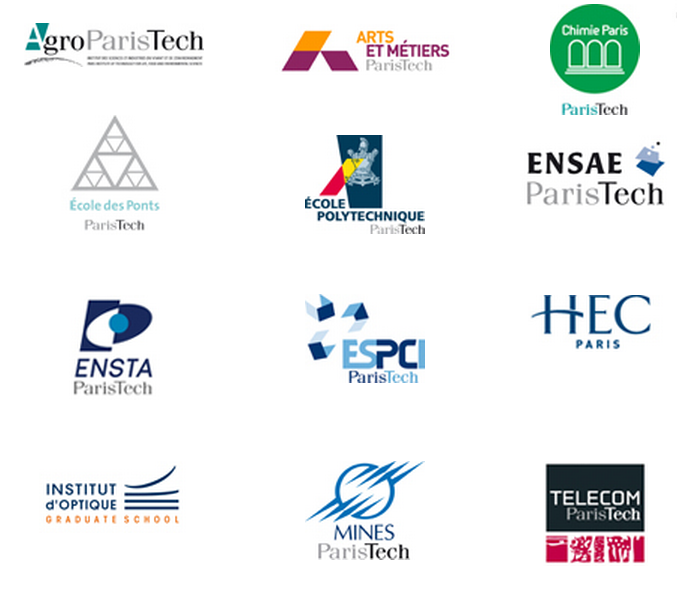
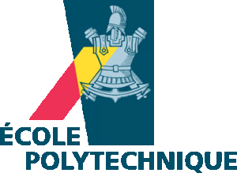

Title: 2011巴黎高科(ParisTech)申请总结
Date: 2012-10-07 17:06
Slug: PT-summery
Tags: 出国, 巴黎高科

这个总结早就应该写了, 拖延到今天实在惭愧...... 赶在今年申请的同学还没笔试之前把它写出来吧...

一. 法国大学校&巴黎高科集团介绍
==============
交大的法国项目很多, 最主要的有巴黎高科(9+9), 中央理工(4+4), 法国高旷联盟(GEM), 以及N+I项目. 但是感觉交大的同学们对于法国项目知道的很少, 我是大三考完托福后才知道有巴黎高科这个项目(感谢HY跑步时告诉我T_T......) 

当然也不能全怪同学, 教务处不知为什么, 总把法国的项目放到很不显眼的位置. 今年交大刚刚和巴黎高科成立了[联合学院](http://www.polytechnique.edu/accueil/actualites/l-ecole-paristech-shanghai-jiaotong-accueille-sa-1ere-promotion-271762.kjsp?RH=ACCUEIL-FR), 按说交大应该会大力宣传下吧, 可是今年的报名通知竟然放在了一堆游学项目里...... OK, 吐槽完毕, 开始正题...

法国教育制度
------
法国的教育体系非常奇葩... 它有着世界上独一无二的教育体系(and我记得那次中央理工的校长说他们很为此骄傲==...). 法国的高等教育体系分为大学教育(普通教育)和大学校教育(精英教育), 两套体系完全并行. 见下图(盗图自QYQY): 

简单讲, 就是法国的学生高中毕业后拿到BAC文凭, 之后可以选择进入大学学习或进入预科学校学习. 进入大学的条件很宽松, 法国的大学教育强调平等接受教育的权利, 宽进严出. 而如果选择进入预科学校, 则要经历两年的密集的数学物理课程培训, 难度应该比国内的大一大二只高不低. 预科学校学习两年后, 学生经过激烈的竞考(难度很大, 淘汰率很高), 通过的学生才可以进入法国的大学校(Grandes Écoles)学习. 

我记得只有不道10%(大约2%??)的法国高中毕业生有机会进入法国大学校学习. 法国的大学校主要分为工程师学校和高等商学院. 工程师学校注重于培养工业界人才, 很重视实践和与企业的合作, 在法国享有很高声望. 工程师学院毕业生拿到的是工程师文凭(Diplôme d’Ingénieur, BAC+5). 听学长说虽然法国的硕士也是BAC+5, 但是工程师学位含金量更大... 关于工程师学位可以参考[这里](http://new.ingenieur.org.cn/2010/01/%E4%BB%80%E4%B9%88%E6%98%AF%E2%80%9C%E5%B7%A5%E7%A8%8B%E5%B8%88%E5%AD%A6%E4%BD%8D-diplome-dingenieur-francais%E2%80%9D%EF%BC%9F/).

巴黎高科集团及中法9+9项目简介
----------------

巴黎高科集团由法国最有声望的12所大学校组成, 这些学校可以说是法国精英教育最出色的学校. 学校的规模很小, 如巴黎高等矿业学校(Mines)每年全球大概只招收120人, 规模最大的巴黎综合理工学校(École Polytechnique)每届也不过招收500人. 

中法9+9(50名工程师)项目是中法两国为了培养一批熟悉中法文化的工程师而建立的合作项目. 首先"9+9"不是指9年加9年(囧...)...... 之所以叫"9+9"是因为一开始巴黎高科集团是9个成员, 中国方面是9所高校(), 每年大概有50人赴巴黎高科学习. **但是... **现在高科集团现在扩充为12所高校, 而在中国, 2011年浙大加入该项目, 貌似2012年武大和华科也要加入, 而且每年高科集团一共录取的人数大约为80人, 所以这项目名字该改成"12+12"或者"80名工程师"才比较靠谱...

关于这个项目, 罗列一些优点和缺点:

**优点**

+ 不要求GRE或toefl成绩; 
+ 申请时没有法语要求, 申请流程较简单, 周期较短; 
+ 掌握法语的优势; 
+ 学费全免(据说学费每年2万欧??), 奖学金机会多, 足够生活费(他们的口号就是: "money should not be a discrimination");
+ 强调通识教育, 很容易转专业;
+ 重视实习, 上学期间会有两到三次的企业实习(对找工作很有帮助), 没有奖学金的话实习基本上也能赚回来了;
+ 工程师在法国认可度高, 比较容易找工作(法国或国内法企);

**缺点**

+ 工程师学校重实践不重科研(可能EP是个例外吧...), 想搞科研的同学不要来;
+ 学校太小, 国际知名度不高(不过在欧洲还是很知名的, 高科属于欧洲IDEA联盟);
+ 通识教育, 没有很深入学习某一方面, 他们认为只要你数学物理足够好干啥都没问题...

总结一下, 就是去高科和去北美读硕读博是两条很不一样的路. 选择高科的话未来大多成为工程师, 进入企业, 基本不会进入实验室从事科研. 所以建议大家想好以后要干什么再做出选择. 而且高科的结果出来的很早, 拿高科保底不太合适(而且很伤RP 有木有...).

巴黎综合理工学校简介
----------

Écoles Polytechnique (昵称X) 是法国最有名的大学校, 也是一所世界知名的学校. 
总结来说, 这是一所具有悠久军事传统的法国名校, 法国最出色的Écoles之一. 关于它的具体介绍可以见文后的附件"交大法国留学手册". 

我只在此列举下它的[wiki页面](http://zh.wikipedia.org/wiki/%E5%B7%B4%E9%BB%8E%E7%BB%BC%E5%90%88%E7%90%86%E5%B7%A5%E5%AD%A6%E9%99%A2)提供的一些校友, 这些名字时常出现在物理和数学书中...

    雪铁龙, 庞加莱, 柯西, 毕奥(毕奥-萨伐尔定律), 马吕斯, 盖-吕萨克, 泊松, 安培, 菲涅耳, 科里奥利, 卡诺, 克拉伯龙, 刘维尔,  约当, 勒沙特列, 亨利·贝克勒......

我大概就是看了这个名单才决定把EP作为申请的第一选择的...

二. 网申&材料准备
=======

学校报名
----
九月份教务处会贴出来高科的报名通知, 可能放在很隐蔽的地方... 所以大家要多关注下教务处或者游学网的通知...
高科基本上不会在合作学校之外招人, 所以学校这关一定要过...... 大概每年学校会推荐50人大名单参加笔试, 学校推荐的名额基本上是看成绩排名吧. 排在TOP15%的同学基本上都可以进入学校的推荐名单. 我们那年申请的竞争有点激烈, 电院有四五个排在TOP5%的同学申请了, 可能高科项目的知名度在提高吧...

网申
---
学校推荐的同时, 自己还要填写高科的网申页面. 注意如果要申请巴黎综合理工(École Polytechnique, 简写EP或X)的话, 还要专门填写EP的网申页面. 这里再说一句, 不通过高科项目(比如学校不在高科的合作学校之列)也是可以申请EP的, 不过那就需要足够好的硬件才能进入EP的面试.

网申可以选择多个学校, 我选择了四所学校: EP, Mines, Telecom, ENSTA. Mines差不多排名仅次于EP, 而规模超小(120人), 每年在中国招生只有3-5人; Telecom电信方面法国最强, 毕业生很好找工作, Telecom在法国大致相当于交大在中国的地位, 而且和交大关系很好; ENSTA是除了EP之外的另一所国防部直属学校, 机械电子能源啥的都很强... 巧合的是, 这四所学校恰好是2012年交大-高科联合学院的四所法国学校......

网申页面需要上传一些文件和图片. 身份证复印件, 护照复印件, 照片什么的就不说了, 按照要求准备就可以. 下面说一下比较重要的SOP, CV, RL.

SOP
---
动机信在网申和面试中非常重要, 需要好好对待. 在动机信里, 一是要表现出你对未来的规划, 显示你是经过了深思熟虑后才选择的高科; 二是列出你选择高科的理由, 注意最好不要写自己想从事科研(而且如果你想从事科研的话高科真的不太适合你); 三是表明你对法国教育制度的了解以及对高科的向往, 让他们相信你是真的想去而不是仅仅拿高科垫底......

动机信用英文写就可以(当然如果会法语的话可以严重加分...), 动机信要早写, 早早写出初稿后让多个人看, 参考他们的意见进行改写. 当时我参加了GAUnion小组, 小组同学的意见让我受益匪浅... 高科的网申页面可以重复提交的, 你可以先上传一个版本, 修改后再覆盖上传. 我最后定稿的动机信是在9月30号, 也就是高科网申结束的前一天, 这之前修改了N(N>10)次...... 

CV
---
简历也是很重要的文件, 关于简历的模板我用的是一个latex模板, **不要太花哨**, 把最重要的信息写出来, **一页即可**, 决不可超过两页. 简历最好加上一项Objective, 写上你想申请高科的工程师, 表明这份简历是专门为高科写的. 申其他学校也是这样, 写上Objective("我想申请你们学校")比较好......

在CV里罗列的内容大概有: 姓名, 专业, 联系方式; GPA和排名; 获奖情况; 所学课程; GT成绩(如果有); 科研经历; 实践经历. 科研和实践经历大家可以把那些看起来比较NB的大作业或者科创课程拿出来, 每项实践经历用两三句话进行介绍...

CV也是他们参考的重要因素, 在高科的面试时他们就一直在拿着我的CV在问问题... 我的硬件条件较为突出(GPA90+, rank 1/97, 三年国奖... 但是硬伤是基本没有科研经历), 所以后来都比较顺利的进入了笔试和面试. 如果硬件不是很突出(比如TOP10%-TOP20%之间的同学), 则需要在笔试中有较为出色的发挥才能进入面试...

RL
---
高科和EP的网申都要求两位老师的推荐信, 我也不知道推荐信可以起多大作用, 但是最好还是认真对待吧... 我找了自动化系两位有德国留学背景的老师(席裕庚老师和袁景淇老师, 两位大牛啊...)写推荐信. 这里赞一下自动化系的老师们, 对学生超级好的!!~ 席老师人超级和蔼, 有求必应; 袁老师只要是大三下他那门过控考得好, 就会给你推荐~

推荐信一般是自己写好了一个初稿然后交给老师, 老师再进行修改后提交给高科. 一般字数二三百就可以了吧, 尤其是我这种没有跟老师做过项目的人, 更没什么可以写的. 在RL的写作中GAUnion小组也提供了很大的帮助...

还要注意的一点是, 高科面试时需要提交纸质推荐信. 你需要把推荐信打印后放在信封里, 然后封口, 让老师们在信封上签字. 

其他东西
-------
EP的申请除了网申还需要邮寄, 具体的材料清单可以看[EP的网站](http://www.admission.polytechnique.edu/home/ingenieur-polytechnicien-program/), 有个checklist. 我们那年还要出生证明, 今年好像不要求了. EP的网申填写很繁琐, 还要写每年的排名, 不过这些东西自己估着填一下就可以了. EP还要求动机信和简历, 可以从高科的PS/CV修改. 另外如果提供奖学金证明(奖学金复印件即可吧)可以免除申请费. 

托福成绩可以提供(作用不大), 不必让ETS送分, 把纸质的托福成绩单复印下即可. 不建议提供GRE成绩, 这会让他们怀疑你有心申请美国... 我的GRE算是白考了...

有一样比较纠结的东西是排名证明...... 我当时在学院和学校的教务处跑了N次后, 学院终于给开了一个证明. 不过后来教务处又给每人开了一份排名证明...... 总之这个事情虽然纠结但是一届届大家还都能够最后搞定......

三. 笔试
========
巴黎高科的笔试一般在十月中旬. 会收到邮件通知, 以及[网上通知](http://www.paristech-china.com/writtentest/instructions.html). 我是10月10号收到通知, 10月15号考试...... 所以需要提前复习一下啊否则来不及复习都不会就囧了...

关于高科的笔试, 我觉得他们还是比较看重CV和SOP, 如果排名较高的话, 只要笔试成绩中等水平就应该可以进入高科的面试. 如果GPA不高, 则需要在笔试中表现得出色一点, 以进入面试. 

高科的笔试安排在同济的瑞安楼, 交大同学过去要俩小时...... 所以打好提前量...... 笔试的内容是数学物理以及专业课, 全部是选择题, 对一道得3分, 错一道扣1分...... 

这里是高科的笔试考试范围: [巴黎高科笔试范围参考.pdf](./PT-summery/%E5%B7%B4%E9%BB%8E%E9%AB%98%E7%A7%91%E7%AC%94%E8%AF%95%E8%8C%83%E5%9B%B4%E5%8F%82%E8%80%83.pdf) 

第一场是数学, 分数学1和数学2, 要申EP的同学需要做数学2. 难度大概比GRE sub稍难一些吧, 但应该超不过交大高数考试的难度...... 高数内容比较简单, 线代当时我是下了比较大功夫复习的(因为忘的比较干净...), 记得考试时有好几道关于特征值特征向量的题目... 数学2比较难, 有好多没学过的内容就直接没做......

第二场是物理和专业课, 物理我感觉蛮难的, 一共十几道题, 每一题的题干都很长...... 而且算出来结果没有出现在选项里的话就很崩溃...... 物理做完后选择自己的专业课, EE的题目比较简单, 有一些信号的内容, 还有些编程以及数电模电的东西, 但都是很简单的, 这些课程不必费太大力气复习.

准备笔试时拿了点GRE sub做了两套: [sub.zip](./PT-summery/sub.zip) 
我觉得词汇才是重点, 英语的题干要是看不懂就囧了, 可以带词典, 我嫌词典太重, 就自己打印了份sub词汇表, 用那种一页两面的打印, 刚刚好... [sub词汇.zip](./PT-summery/sub%E8%AF%8D%E6%B1%87.zip) 
<file:///media/FILES/Course/portal/sub/%E5%B7%B4%E9%BB%8E%E9%AB%98%E7%A7%91%E7%AC%94%E8%AF%95%E8%8C%83%E5%9B%B4%E5%8F%82%E8%80%83.pdf>

btw, 在同济监场的是俩帅哥, 后来才知道他们是Telecom来交大交流的学生...

四. 高科的面试
===========
笔试完了之后面试大约在10月底, 在[这里](http://www.paristech-china.com/interviews/)会有面试通知, 2011年我们是30号面试的. 还是在同济, 不过还算比较人性化, 把交大的面试安排在了下午, 否则还得提前一天晚上过去(闵大荒村民伤不起!!).

交大那年有三十来人进入了面试, 笔试淘汰率不太高的. 然后这次高科的面试不是技术面, 主要还是询问你的动机. 着装的话有正装可以穿去, 不过其实也无所谓的, 别太邋遢即可. 我就牛仔裤衬衫去了(因为没租到正装)...... 

面试在同济的中法中心进行, 一共有三四个房间, 基本上是你报了哪几所学校, 这几所学校的老师就回来面试你. 不过EP的人一个也没来, 因为他们有专门的面试... 面试时拿着纸质版简历和推荐信以及护照什么的. 

建议面试前把动机信再好好看看, 另外再了解下各个学校的特点, 那些方面比较强, 这样面试的时候显得你已经对他们研究很久了... 这里有个简单的介绍: [Relations_domains_schools_ParisTech.pdf](./PT-summery/Relations_domains_schools_ParisTech.pdf) 

另外我把BBS上学长学姐们的面试回忆放在了一起打印了出来: [ 面经.pdf](./PT-summery/%E9%9D%A2%E7%BB%8F.pdf) 

面我的是一个ENSTA的老师(帅哥), 一个Mines的老师(大胡子, Julien), 还有一个Telecom的老师(大鼻子...). 主要是ENSTA的老师在问问题(难道是看到我是自动化系的所以比较亲切??...). Juien询问了我选择高科的原因, 这是面试时都会问的一个问题, 最好能够有条理地说出来, 我说我进行了一个简单的SWAT分析啊, 觉得高科最适合我啊, blablabla...... 他们听了笑而不语...... 

然后ENSTA的老师又拿着我的简历问我为啥选择电院的自动化专业啊, 做的科创都是干了点什么东西啊之类的, 我给他说了说, 然后又强调了我没有做过研究, 对实际应用比较感兴趣......

然后ENSTA的老师让我把我申请的这四所学校按照优先级排序...... 没办饭, 我只好实话实说了, 我说第一选择是EP, 因为知名度最高; 第二选择是Mines, 因为Mines的毕业生很多进入了法国企业的高管, 然后我又补充说EP和Mines都是很想去的学校, 要是都录取了的话我得好好考虑才知道到底去哪里; 第三选择是ENSTA, 因为他们的机电还有机器人什么的很棒(ENSTA的老师很得意); 第四选择是Telecom, 他们的电子信息方面是法国最好的(Telecom的老师对我把他们排在第四位很不满, 表情严肃...... 最后Telecom果然没录取我). 最后, 他们问我是否有问题问他们(这也是个保留项目), 我问他们觉得中国学生和法国学生有啥区别, 他们说没有, 他们一视同仁......

面试大概持续了二三十分钟吧, 建议提前准备下如何回答他们的问题以及如何表达自己想去高科的愿望, 让他们相信你是真想去而不是拿来保底.......

高科面试之后, 如果没有申请EP或Mines的话, 高科的申请就结束了, 接下来就是耐心的等待, 录取结果大约在十二月中旬出来...

五. Mines的面试
========
高科面试结束后, Mines和EP会进行单独的面试, **单独面试的表现才会决定最终的录取**. 所以如果想进入Mines或者EP的话, 面试完了还要继续苦逼的看高数和大物...

2011年11月17日收到Mines的面试, 面试在11月21日. Mines的面试是视频面, 在图书信息楼的7楼进行, 不用跑同济了... 一共有三个同学进入了面试, 每人面大约半小时. 

额, Mines的面试啊, 这事不能说得太细......

之前李哲学长(X2010)在BBS上写了他当时[面试回忆](https://bbs.sjtu.edu.cn/bbsanc,path,%2Fgroups%2FGROUP_5%2FFrench%2FD515BBF70%2FDC4C032D6%2FDBBB9C57C%2FM.1321227794.A.html), 学长把面试时做的题目是啥都写了, 于是我复习时就打印出来做了做... 结果面试时遇到的题目和李哲学长那年的一样!!...... 有点幸运了...

Mines的面试题目可以参见学长的文章. 面试持续半小时, 感觉Mines的面试注重的是应用, 比如二阶偏导, 比如解微分方程...... 而EP的面试则注重分析推导. 拿到题目不会做没有关系, 老师会给你提示, 如果能够快速反应过来按他们的提示做出来题目, 他们会很高兴...

面试是面对一个摄像头和一个显示屏, 那边的老师给你念出题目你在黑板上做. 网络条件很不好啊, 时不时的就"sorry, the image is frozen AGAIN"... 

另外强烈建议**看一些国外数学公开课**, 我看的是MIT的一个老师讲的微积分重点(Course Highlights of Calculus), 葡萄上有下载. 这个课程内容很简单(介绍微积分的最基本内容), 我只看了七八集. 看这个倒不是为了复习高数, 而是学会那些数学用语用英语怎么说... 比如次方, 求导, 积分, 对数之类的术语... 因为面试是向他们用英语讲题嘛...

六. EP的面试
=====
11月17日收到邮件, 通知我12月2日去同济进行EP的面试. 进入EP面试的人不多, 电院只有三个人... 关于谁进入EP的面试可能主要还是看GPA吧, 如果高科的笔试表现很出色的话也应该会进入EP面试. 据说一旦进入了EP的面试, 会不会;录取就完全取决于面试时的表现, 和GPA或排名什么的就无关了...

EP的入学竞考是法国历史最久, 难度最大的竞考之一. EP的面试分三场, 一场数学一场物理一场综合知识(比重貌似是6:4:4?), 大概会持续四个半小时...... 会有三个教授对你进行面试, 他们期望在这四个半小时里全面地了解你, 不仅是考察数理基础, 还包括言谈举止(比如主动擦黑板...)各个方面.

EP的考试范围: [EP-考试范围.zip](./PT-summery/EP-%E8%80%83%E8%AF%95%E8%8C%83%E5%9B%B4.zip) 

个人感觉EP的面试难度比Mines高很多!! 比如这是EP网上提供的面试题样题: [examples-eng.pdf](./PT-summery/examples-eng.pdf)  这个题我和zbf同学在自习室捣鼓了很久才差不多搞出来......

而且EP的老师会根据你动机信里的内容, 对每个人出不同的题目. 比如有学长写他的试验能力很强, 教授就给他出了一道基于实验的题目. 对于数学系的同学他们的题目必然要难很多, 工科学生的话出的题目就简单一些... 幸亏我没在SOP里写我有什么特长, 他们给的题目还算中规中矩, 否则肯定跪了...... 

准备EP的面试的过程非常痛苦, 不知道他们会出什么难度的题目, 又把高数线代大物好好看了一遍. 并且我把BBS上学长们的考试题回忆全部打印下来做了做: [EP面经.pdf](./PT-summery/EP%E9%9D%A2%E7%BB%8F.pdf) 

EP的面试会持续一星期, 因为他们一上午只能面试四个人(两组老师). 我是12月2号下午面试, 先是数学, 老师给了两道题, 自己做30分钟. 一道是数列的极限以及收敛的速度, 前两问比较简单可以用数学归纳法做出来, 第三问收敛速度不知道咋做就跳过了. 第二道是线代的题目, 定义了两个矩阵的一种运算(SORRY没带日记本来所以题目的内容忘了!!...), 然后让你证明一些结论... 由于我理解有误所以也不大会做...

然后去给老师讲, 第一道题前两问讲完后, 第三问在老师的提示下......还是没做出来(弱爆了)... 还有十分钟时老师让我讲下一题... 我对题目理解错了, 不过前两问比较简单, 一会就做出来了(其实前两问就是铺垫, 为了得出第三问的结论). 第三问不会做, 老师提示: 先假设矩阵是对角阵? 然后我捣鼓出来了时间也到了, 然后老师说你看, 对角阵有这个结论吧? 非对角阵只要对它进行对角化我们就能得到这个结论了blablabla...... 我其实也没听懂就出来了...... 

休息一会后, 第二场是物理. 还是两道题, 一道是卫星怪象(卫星受到阻力之后速度反而增加), 第二道是运放工作在饱和区...是的, 之前学长写过这道题, 我又踩狗屎了...

然后给老师讲题, 第一题做完后老师又让我进一步思考: 假设卫星收到的阻力和速度成正比, 该是什么情况, 要是和速度的平方成正比又是什么情况...... 第二题我一开始做错了(亏我之前看过学长的面经)...... 不过还好在老师的帮助下总算做出来了, 解一个微分方程就可以...... 

物理面完再休息一会, 第三场就比较轻松了. 那个数学老师给我一篇文章, 是太阳能发电的维基百科, 让我看一下然后跟他们讲讲这篇文章的主要内容. 我讲完后他又问了问我关于这篇文章相关的一些东西, 比如说为啥太阳能天线要设计成抛物面?... 之后就开始问动机了, 这时就和高科的面试差不多. 他拿着我的动机信, 问我为啥选择申请EP,我就说了说那几条理由. 然后他补充说, "而且我们学校可以提供多个学科的教育", 看来EP很以此为傲...... 我又再次向他们说, 目前我只申请了高科的项目, EP是我最想去的学校, 如果去不了的话我可能申香港...... 最后教授问我有啥问题没, 我问了问奖学金的事又问了问EP毕业生的就业情况, 然后就结束了......

感觉我的面试是很幸运的, 没有给我出太难的数学题, 数学题再稍难一点我就挂了...... 另外英语口语好一些的话也有比较大的帮助...

七. 录取通知
====
面试完之后这几天非常纠结, 很害怕没有被录取上, 所以我抽时间写了申请港中文的PS......

在EP面试前, 高科的网上出现了"admissibility"这么一个东西, 意思是这些学校会考虑录取你, 然后要你按照心目中的优先级进行排序. 这么做估计是为了防止一个人被多个学校录取的情况发生. 我的页面里有admissibility的是EP, Mines以及ENSTA. 于是我很纠结如果把EP排在第一位而最后面试没过的话, 会不会排在二三位的Mines和ENSTA不要我... 不过还是下决心把EP排在了第一位...

12月14日下午, 收到EP的邮件, 被录取了!! EP的网申页面终于走到了最后一步...... 好开心啊!!...

不过我们这年的意外情况比较多... 2011年是交大的小年, 只录取了18人(往年都是20+的). 和交大(尤其是和电院)关系最好的Telecom只在电院录取了3个人, 还有电子系很强的zbf同学没有被录取(绝对是他们的损失啊...). 我最后能够如愿进入EP实在是有很大的运气成分......

八. 录取之后
====
记得有学长说过, 一旦你被录取, "everything is orgnized"... 所以录取之后只要时常查一下邮件按照邮件要求的做就是了...

奖学金
---
EP给学生提供720欧/月的奖学金(由La Fondation提供), 足够生活的开支(每月总生活费开支大约600-700欧). 而EP也会帮学生申请著名的埃菲尔奖学金, 该奖学金的好处参考[这里](https://bbs.sjtu.edu.cn/bbsanc,path,%2Fgroups%2FGROUP_5%2FFrench%2FD515BBF70%2FD5829ED0F%2FM.1257698441.A.html)... 总之是各种爽... 只需要填一个EP的表格(大概是把SOP的内容改改粘上去), 然后EP会帮你申请埃奖.

之前有传闻埃奖是随机分配的, 或者是按照姓名首字母分配的(额...), 不过这次的结果似乎还是排名高一点的同学有较大机会拿到埃奖. 我们这年交大5个埃奖(2EP, 1Mines, 1 Telecom, 1ENSAE).

除了埃奖, 还可以申请国奖, 数额和埃奖类似只是申请过程比较繁琐... EP的人因为有学校奖保底所以一般不会申请. 国奖的申请流程见附件"交大法国留学手册"... 除了埃奖国奖, 还有一些企业奖和地区奖, 今年campusfrance也增加了一个奖学金. 即使没有奖学金也问题不大, 因为实习时就会有工资拿了...

法语学习
----
**同学们要好好学习法语啊!** T_T... 

虽然EP第一年会有半年的学法语时间, 我现在也后悔当初没有好好上法语课, 这边分班分到了水平底的班级......

上海的法语培训机构主要是凯育和芳赛, 我们当时两边询问比价, 最后把价格减少了很多...... 一半人去凯育一半人去芳赛, 我在凯育上课, 凯育的何春燕老师上课很赞, 可惜我没好好学...... 高科要求的TCF/TEF成绩是B1, 最后还是很容易达到的, 其实即使考了A2也不会有任何问题. 

其他
----
**签证**

GEM项目有时会有签证悲剧的情况, 但是高科项目的历史签证通过率是100%...... 按照campusfrance上的通知一步步走即可. 关于签证的材料见附件: [签证材料.zip](./PT-summery/%E7%AD%BE%E8%AF%81%E6%9D%90%E6%96%99.zip) 

**疫苗**

EP会发一封邮件通知你去接种疫苗以及体检, 在上海出入境检疫中心, 有的人可能会打两针, 这样的话需要提前去打否则到了法国还要再打...

九. 法国留学参考资料
========
+ [交大法国留学手册.pdf](./PT-summery/%E4%BA%A4%E5%A4%A7%E6%B3%95%E5%9B%BD%E7%95%99%E5%AD%A6%E6%89%8B%E5%86%8C.pdf)  
这个手册很给力, 介绍了交大所有法国项目的情况, 强烈推荐认真阅读...
+ [交大欧洲留学手册.pdf](./PT-summery/%E4%BA%A4%E5%A4%A7%E6%AC%A7%E6%B4%B2%E7%95%99%E5%AD%A6%E6%89%8B%E5%86%8C.pdf)  
这个是比较早的一个手册了, 介绍了交大的欧洲项目
+ [上海交通大学goabroad2012大型出国留学讲座PPT汇总.pdf](./PT-summery/%E4%B8%8A%E6%B5%B7%E4%BA%A4%E9%80%9A%E5%A4%A7%E5%AD%A6goabroad2012%E5%A4%A7%E5%9E%8B%E5%87%BA%E5%9B%BD%E7%95%99%E5%AD%A6%E8%AE%B2%E5%BA%A7PPT%E6%B1%87%E6%80%BB.pdf)  
GAUnion的PPT很给力, 让你发现美国之外的其他选择~ 另外强烈建议大家加入GAUnion, 氛围很好帮助很大!
+ 饮水思源BBS-french版精华区
有很多学长的总结贴, 推荐认真看一看.

OKOKOK... 写这么多行了... 祝大家申请顺利!!

