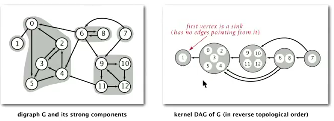
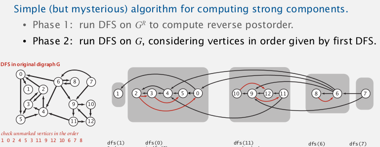

Title: [Algorithms II] Week 1-2 Directed Graphs   
Date: 2015-11-09   
Slug:  algoII_week1_2      
Tags: algorithm      
   
1. Intro to digraphs   
====================   
   
Has profound differences wrt undirected graphs.    
   
def: digraph   
* edges: have directions   
* vertex: distinguish indeg and outdeg   
   
   
digraph pbs:    
   
* path/shortest path   
* topological sort: Can you draw a digraph so that all edges point upwards?   
* strong connectivity: Is there a directed path between all pairs of vertices?   
* transit closure   
* PageRank   
   
   
2. Digraph API   
==============   
   
	public class Digraph{   
		Digraph(int V);   
		void addEdge(int v, int w);// edge is directed   
		Iterable<Interger> adj(int v);// vertices reached by outgoing edges   
		int V();   
		Digraph reverse();// <--new methode wrt undirected graph   
	}   
   
representation: adj-list, ie. an array of bags.    
``Bag<Integer>[] adj;// prec vertices``   
   
3. Digraph Search   
=================   
BFS and DFS can be applied to digraphs.   
   
* reachability   
   
find all vertices reachable from vertex-s.    
use the same DFS as for undirected graphs.    
→ application: programme control-flow analyse, garbage collection.    
   
   
* *DFS is the basis for a lot of digraph pbs*: 2-satisfiability, Euler path, strongly connected component.    
   
   
   
* multiple source shortest path:    
   
   
⇒ use DFS but *enque all vertices in the set*.    
→ application: web crawler(DFS not suitable for crawling)   
   
4. Topological Sort   
===================   
application. precedence schedule, java compiler (cycled inheritance), ...   
   
def. **topo-order**   
is a permutation of vertices, where for each vertice v→w, w is behind v in the permutation.    
   
def. **DAG**   
directed acyclic graph.   
**prop. **for a digraph, topological order exists *iff* graph is a DAG.    
   
algo: ⇒ use DFS~    
*reverse DFS postorder*   
   
def.	**postorder**   
is the order of the vertices that we have *finished* (ie. we have visited all reachable vertices from this vertex).   
   
### implementation   
这个以前的blog写过...    

	private boolean[] visited;   
	private Stack<Integer> revPostorder;// stores the vertices in reverse post order   
	private void dfs(Digraph G, int v){   
		visited[v] = true;   
		for(int w: G.adj(v))   
			if(!visited[w])   
				dfs(G, w);   
		//** now we know the vertex v is "finished" **   
		revPostorder.push(v);   
	}   
	public Iterable<Integer> topoOrder(Digraph G){   
		for(int v=0;v<G.V();v++)   
			if(!visited(v)) dfs(G,v);// visit all cc   
		return revPostorder;   
	}   
   
   
### proof   
**prop. **reverse post-order of a DAG is in topological order.    
(这个证明蛮精彩)   
**pf.**   
for any edge **v→w**, when ``dfs(v)`` is called:    
   
* case 1: ``dfs(w)`` is called and returned, so w is done before v in post-order;   
* case 2: ``dfs(w)`` is not called, it will be (in)directly get called by ``dfs(v)``, so ``dfs(w)`` finishes before ``dfs(v)``;   
* case 3: ``dfs(w)`` is called but NOT returned (ie, w not *finished*) → exist path from w to v ⇒ graph is not a DAG! (cycle detection)   
   
   
   
5. Strong Components   
====================   
For undirected graphs: connected components can be solved with dfs or UF.    
   
def. **Strongly-connected**   
v and w are strongly-connected if exist path from v to w and w to v.    
→ is an equivalent relation.    
   
def. **Strong Component**   
subset of  V where each pair are strongly-connected.    
   
Goal: compute all strong components(*scc*) in a digraph.    
   
linear time DFS solution: Tarjan (1972)   
---------------------------------------   
(developed version: a two-pass linear-time algorithm)   
   
Intuition: *scc for G is the same for G.reverse().*   
   
**Kernel DAG**: contract each scc into a single vertex.    
   
   
Idea:    
   
* compute topological-order in the kernel DAG.   
* run DFS, consider vertices in reverse-topo-order    
   
   
>**[Algo]**   
1. compute topo-order in ``G.reverse`` (just a DFS in the reversed graph)   
2. run DFS in original  ``G``, *visit unmarked vertices in topo-order of G.reverse*. (instead of visiting vertices by their index)   
   
⇒ **each time we finish a dfs from a vertex, we get a scc!**     
太精彩了!!!   
   
   
proof: tricky, cf book...(貌似Werner课上讲过..)   
   
implementation   
--------------   
   
	private int[] scc = new int[V]; // scc[v] is the index of the SCC that v belongs to   
	private int sccCount = 0;   
	private boolean[] visited = new boolean[V];   
	public getSCC(Digraph G){   
		// 1. get topo-order in reverse graph   
		Iterable<Integer> topoOrderGR = topoOrder(G.reverse());   
		// 2. run dfs in original graph, run on vertices using the above topo-order    
		for(int v:topoOrderGR)// <-- only difference from the standard topo-order algo   
			if(!visited[v])   
				dfs(G, v, sccCount++);//increment sccCount everytime we done a component   
	}   
	private dfs(Digraph G, int v){   
		// run dfs from v, and all touched vertices are marked in sccId's SCC   
		visited[v] = true;   
        scc[v] = sccCount;   
		for(int w:G.adj(v))   
			if(!visited[w]){   
				scc[w] = sccCount;   
				dfs(G,w);   
			}   
	}   
   
   
