Title: [Algorithms I] Week 1-2 Analysis of Algorithms
Date: 2015-07-02
Slug:  algoI_week1_2
Tags: algorithm


1. Introduction
===============   
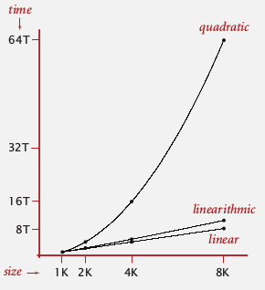


2. Observations
===============

ex. **3-SUM pb**  
*given N distinct numbers, how many triples sum up to 0? (pb related to computatioal geogtry)*

* brute force method:

```
for(int i=0;i<N;i++)
    for(int j=i+1;j<N;j++)
        for(int k=j+1;k<N;k++)
            {if(a[i]+a[j]+a[k]==0)
                count++;
            }
```

* mesuring running time:

stdlib.jar里面提供了一个``Stopwatch``类用于记录运行时间.    
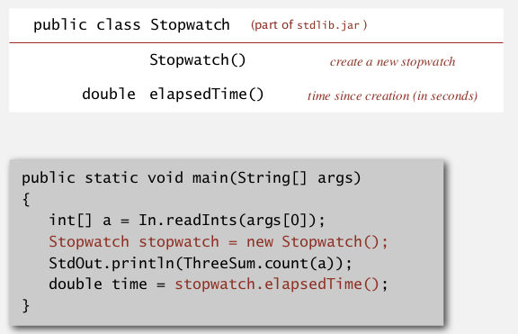


* log-log plot

T(N) = running time for input of size N  
log(N)-log(T(N)) plot:  
often get a straight line — power law    
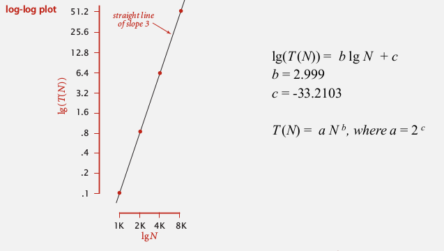

* **doubling ratio**:

(for checking the power law relationship, checking the power order)  
each time double the size of input, then take log of the time ratio of 2 runs: log( T(2N)/T(N) )    
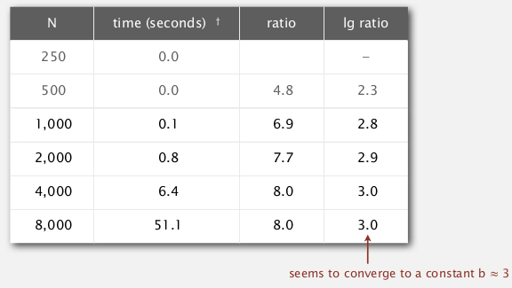  


3.Mathematical Models
=====================


* total running time: sum of cost*frequency of operations 
* cost of some basic operations:

	- array allocation: c*N (because all array entries have to be set to 0/false/null)
	- string concatenation: c*N (proportional to the length  of string !)

* simplification

crude analysis  
ignore lower terms **tilde notation**    
    
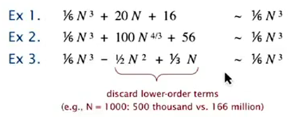

* estimating discrete sum by relaxation

Replace the sum with an integral, and use calculus — 很机智...     
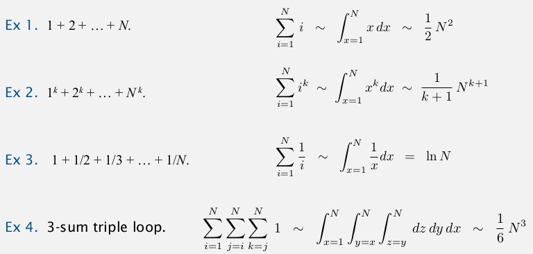


4. Order of Growth Classification
=================================
(discard the leading coefficient when considering the growth order)


* only a small set of growth functions: 

``1, logN, N, NlogN, N^2, N^3, 2^N   ``   
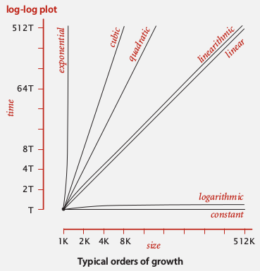   

* exemples:

binary search ⇒ logN  
divide and conquer ⇒ NlogN  
exhaustive search ⇒ 2^N   
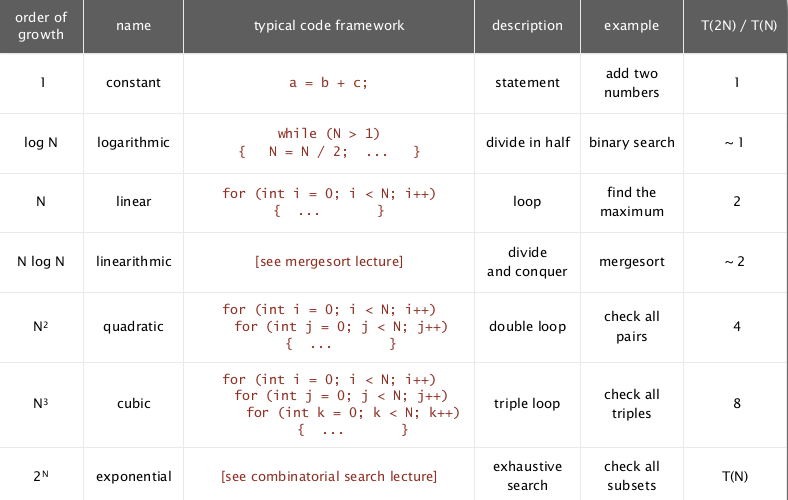
	
practical performance:   
  

* ex. **binary search**

    public int binearch(int arr[], int key){//arr[] already sorted
        int lo=0,hi=arr.length;
        while(i<j){
            int m = (lo+hi)/2;
            if(arr[m]==key) return m;
            else if(arr[m]<key) lo=m+1;
            else hi=m-1;
        }
        return -1;
    }

(→ Bug in Java's Arrays.binarySearch() discovered in 2006......)   
→ invariant: if key in arr, arr[lo]<=key<=arr[hi]   
**proposition. **binary search uses at most logN+1 compares to search a sorted array of size N.
**pf. **
denote *T(N)* := nb of compares for array with size <=N  
→ T(1)=1  
→ recurrence relation: T(N)<=T(N/2)+1  
⇒ T(N)=logN  


* **a faster 3-SUM**

→ first sort the array *(~NlogN)*  
→ for any pair a[i] and a[j], do binary search for -(a[i]+a[j])   *~(N2LogN)*  
⇒ reduce from N3 to N2logN ! (for 8k numbers, running time goes from 51s to 0.96s)  


5. Theory of Algorithms
=======================


* types of analysis

	-best case
	-worst case
	-average case(random input, "expected cost")

* notations

**big Theta/big O/big Omega**    
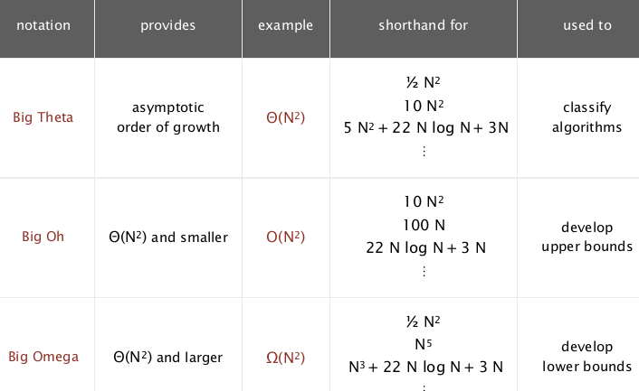     
	- big O: *upper bound  → * once a specific algo is found, find an upper bound  
	- big Omega: *lower bound   *→ proove that no algo can do better  
	- big Theta: symptotic growth (same order, optimal algo)  → lower and upper bound *match*   
     
⇒ in this course: use tilde notation: contain leading constants for highest order term
	

6. Memory
=========


KB: 2^10 bytes  
MB: 2^20 bytes (1 million) 
GB: 2^30 bytes (1 billion) 
64-bit machines: *8 byte pointers*  

* typical memory usage:

for primary types:   
  
for arrays  (with *array overhead=24bytes*) :    
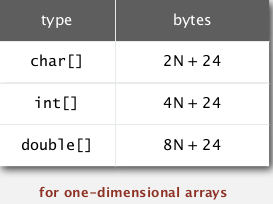   
*Obj overhead: 16 bytes* (obj的大小=16+obj内部filed的大小)  
*references*: 8 bytes (ex. inner class has a ref to encolsing class)  
*padding*: each obj uses a multiply of 8 bytes (obj大小=8 bytes的整数倍)      
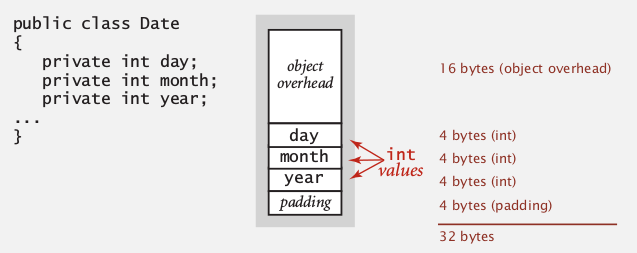     
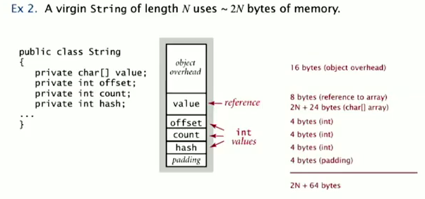     
