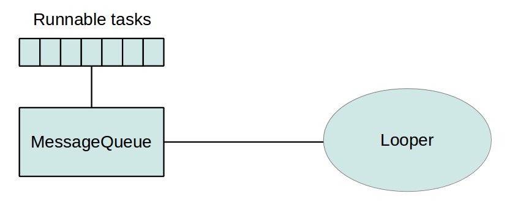

Title: java线程小结
Date: 2013-11-29
Tags: android, java
Slug: java线程小结

INF422的TD2, 这节TD是要做一个多线程筛选质数的程序, 关于java的多线程, 以前用过但是不知道啥意思, 在这里总结下. 

创建进程
----
为了实现多线程, 需要定义一个新的class, 有两种方法: 
**或者继承自**``Thread``**类, 或者实现**``Runnable``**接口**(关键是重载run()方法). 

### 继承自Thread类

* 写法1: 定义一个继承自Thread的内部类--

        class [类名] extends Thread{
        方法1;
        方法2；
        …
        public void run(){
        // …
        }
        属性1；
        属性2；
        …
        }

* 或者用下面种**内联(inline)**的写法, 不用给这个类起名字了(不过还要给这个实例取名字): 

        private Thread [实例名] = new Thread () {
            public void run() {
            // ...
            }
        } ;

然后让进程开始, 就是: 
``t.start();``
如果用``t.run()``的话, 则依然是并行执行的, 可能达不到多线程效果...

### 实现Runnable接口

* 方法1, 代码: 

        class [类名] implements Runnable{
        方法1;
        方法2；
        …
        public void run(){
            // other code…
        }
        属性1；
        属性2；
        …
        }
        

* 方法2, 内联写法:

        private Runnable [实例名] = new Runnable() {
        public void run() {
            //...
         }
        };

android上需要注意的一点
---------------
>>
"Android modifies the user interface and handles input events from **one single** user interface thread. This thread is also called **the main thread**."

Android collects all events in a queue and processed an instance of the Looper class.

*所以注意要修改用户交互的组件(View, Toast, ect.)的时候, 需要在main Thread里面操作, 否则运行时会出错!!* 

那么, 当其他线程进行计算完成以后, 要刷新屏幕的显示时, 需要告知main Thread 进行更新显示:

"Ajouter un nouvel objet comportant une méthode run() mettant à jour le nombre d'entier premiers (nouvel objet implémentant l'interface Runnable). À la fin du crible, le thread de calcul devra alors envoyer un message (ce nouvel objet) au thread principal pour mettre à jour l'affichage graphique. Cette mise à jour doit être faite via un appel à la méthode post() d'une instance de la classe Handler (l'objet Handler doit être instancié dans le thread principal)."

Bref, 要做到多线程计算, 计算结果显示在屏幕上, 需要:

1. 添加一个Runnable实例("一个实现了Runnable接口的类的实例"), 重载run()方法实现calcul
2. *一个*[Handler](http://developer.android.com/reference/android/os/Handler.html)*实例, 然后调用这个Handler的post()方法.* 

看看文档里是咋说的: 

>>
public final boolean post (Runnable r)

Added in API level 1
Causes the Runnable r to be added to the message queue. The runnable will be run on the thread to which this handler is attached.

Parameters
r	The Runnable that will be executed.
Returns
Returns true if the Runnable was successfully placed in to the message queue. Returns false on failure, usually because the looper processing the message queue is exiting.

意思是``handler.post(r)``会把r(一个Runnable实例)加入message queue中去, *这个Runnable会在这个handler关联的Thread中执行*. 所以只要handler关联的是main Thread, 就可以在这个Runnalbe里面写graphic的代码也不会出错了. 

如果在Activity类的声明里声明handler为一个属性: 
``private Handler handler = new Handler();``
这个构造函数没有参数, 根据文档, "Default constructor associates this handler with the Looper for the current thread." 所以这个handler关联到了current thread, 也就是main Thread.....

例子
--
所以, 多线程计算, 计算结束后修改屏幕显示的话, 需要以下__三个步骤__(比上面的俩步骤多了一个, 不知道是否还可以简化): 

1. 在主线程里声明handler, (声明成Activity的一个属性): 

``private Handler handler = new Handler();``

2. 写一个用于修改屏幕显示的Runnable r(也声明成一个属性了):

        private Runnable r = new Runnable() {
        public void run() {
        //code to update graphic display...
        }
        };

3. 再写一个进行计算的Thread t, 在计算结束后, 用handler.post(r)实现刷新显示的效果: 

        private final Thread t = new Thread() {
            public void run() {
        //...code for calculating...
        //结束计算以后, 刷新屏幕:
        handler.post(r);
            }
        };

4. 然后在onCreate()函数里, 让Thread t 启动起来: 

``t.start();``

5. 需要让t一直循环(监视某个flag), 当flag变为true的时候, 进行计算.

为了达到这个效果, Thread t里面的run()方法需要这样写:

        public void run() {
            while(true) {
                if(flag){
                //...do the calculation...
                handler.post(r);
                flag=false;
                }
            }	
        }

Process, Thread和Runnable的区别?
----------------------------
线程(Thread)是指进程(Process)中的一个执行流程，一个进程中可以运行多个线程。比如java.exe进程中可以运行很多线程。线程总是属于某个进程，进程中的多个线程共享进程的内存。

参考链接: 
<http://www.vogella.com/articles/AndroidBackgroundProcessing/article.html>
<http://www.cnblogs.com/rollenholt/archive/2011/08/28/2156357.html>
<http://developer.android.com/reference/android/os/Handler.html>
<http://lavasoft.blog.51cto.com/62575/99150>
